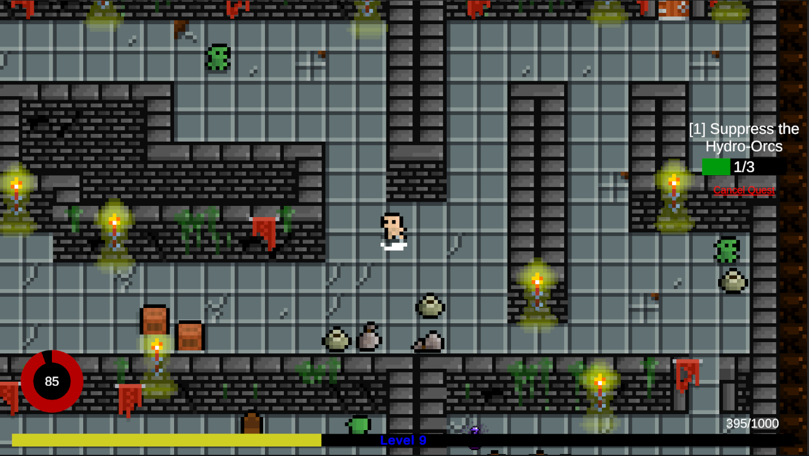

# **กลุ่มงูกระดิ่งหางเห่า**
Final Project - วิชา GI262 Data structures and Algorithms
สาขาวิชาเกมและสื่อเชิงโต้ตอบ คณะเทคโนโลยีสารสนเทศและนวัตกรรม มหาวิทยาลัยกรุงเทพ

### Our Team
- 1660703586 นายปฏิพัทธิ์ จงจรูญชินเลิศ Section 329H เลขที่ 22
- 1660703768 นายกันตพงศ์ ตั้งเชยวิไล Section 329H เลขที่ 24
- 1660704238 นายธีระฉัตร ปาทะรัตน์ Section 329H เลขที่ 28
- 1660706654 นายสราวุธ เดชยศดี Section 329H เลขที่ 33
- 1660706662 นายศักดิ์ชัย ปัดภัย Section 329H เลขที่ 34
- 1660706860 นายธนาธร จีนเก่า Section 329H เลขที่ 35
- 1660707124 นายธุวานันท์ ภุมจุรีรัตน์ Section 329H เลขที่ 36

### Game Overview

Chronicles of the Wanderer เป็นเกมแนว Action RPG / Adventure ในงานภาพแบบ Pixel Art 2D มุ่งเน้นการสำรวจโลกแฟนตาซี ทำเควส เก็บเลเวล และพัฒนาตัวละคร เหมาะกับผู้เล่นอายุ 13 ปีขึ้นไปที่ชื่นชอบการผจญภัยและเกม RPG แบบเล่นสบาย ๆ

ผู้เล่นรับบทเป็น Wanderer นักผจญภัยผู้เดินทางไปทั่วดินแดนเพื่อช่วยเหลือผู้คนในแต่ละพื้นที่ ผ่านระบบเควสหลายรูปแบบ เช่น กำจัดมอนสเตอร์ เก็บวัตถุดิบ หรือพูดคุยกับ NPC เพื่อปลดล็อกเนื้อเรื่องใหม่และเพิ่มพลังให้ตัวละคร